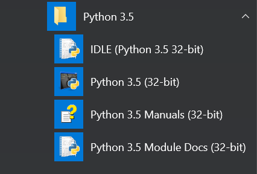

# Instalación

Instalación: Es necesario descargarse el programa de la página web:

[www.python.org/downloads](http://www.python.org/downloads)

Como se puede ver, hay varias versiones con la misma fecha de actualización. Elegid la 3.5.

Una vez descargado ya tenemos todo disponible para desarrollar.

Presentamos los componentes:

El primero es el que usaremos en este curso

  

IDLE es el editor de Python por defecto. Podríamos utilizar muchos otros pero es simple y no hay que instalar nada más. Perfecto para comenzar.

Python 3.5 es el intérprete… ¡Un segundo! ¿Intérprete? Sí, es el programa que ejecutará las órdenes que le escribamos. Esto tiene sus ventajas e inconvenientes, como veremos a continuación.

El tercero se refiere a manuales. Es importante leerlos si quieres profundizar más de lo que lo hace este curso. Como es comprensible, en 20 horas se puede dar únicamente una visión del lenguaje y resolver unos cuantos ejercicios simples. Controlar este lenguaje supone años de programación continuada.

El cuarto se refiere a documentos de módulos. En este curso no veremos lo que son por falta de tiempo pero son necesarios porque amplían las posibilidades del lenguaje. Todo lo que son operaciones matemáticas complejas, conexión a internet... vienen por esta vía.

**Explicación avanzada:**

Existen dos tipos de lenguajes: Los que se interpretan y los que se compilan. Sus diferencias se ven en esta tabla:

|Característica|**Interpretados**|**Compilados**|
|--|--|--|
|**Resultado**|Programa tipo "texto"|Archivo ejecutable, .exe ...|
|**Privacidad del código**|Escasa|Elevada|
|**Multiplataforma**|Sí|No. Sólo funcionará en la plataforma donde se haya compilado|
|**Velocidad de ejecución**|Baja |Alta|

  

Python es un lenguaje interpretado con un motor muy potente que hace que su velocidad de ejecución sea muy alta y hay varios proyectos para hacer tanto archivos .exe como aplicaciones para Android .apk, el primero funciona bastante bien, el segundo está empezando. 

**Salimos de la explicación avanzada:** Los alumnos rara vez conocen estos problemas y, por tanto, no prestan atención a esto. Convendría dejarles unas pocas ideas claras. Éstas serían:

- Para ejecutar el programa en cualquier ordenador tienen que instalarle Python antes. La ventaja que tienen es que, si lo instalan en un Mac, un móvil, una tablet... también pueden ejecutarlo allí. Es decir, sus programas funcionarán en cualquier sistema.

- No obstante, este lenguaje puede, usando ciertas herramientas, producir aplicaciones para móvil o PC. Lo que sucede es que no es inmediato.

