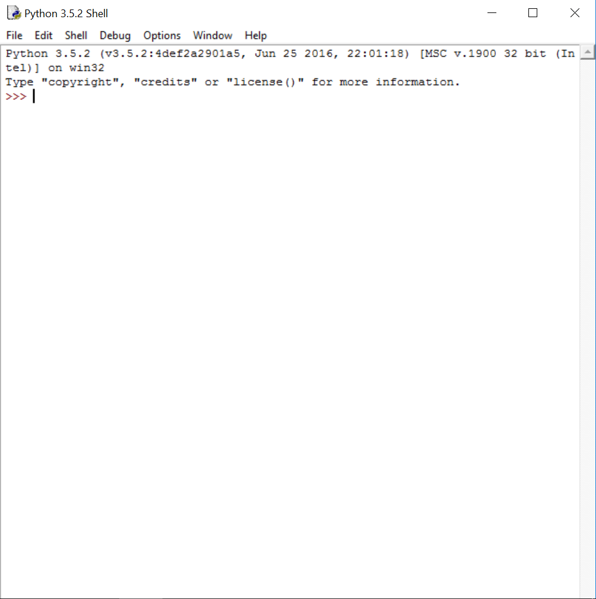
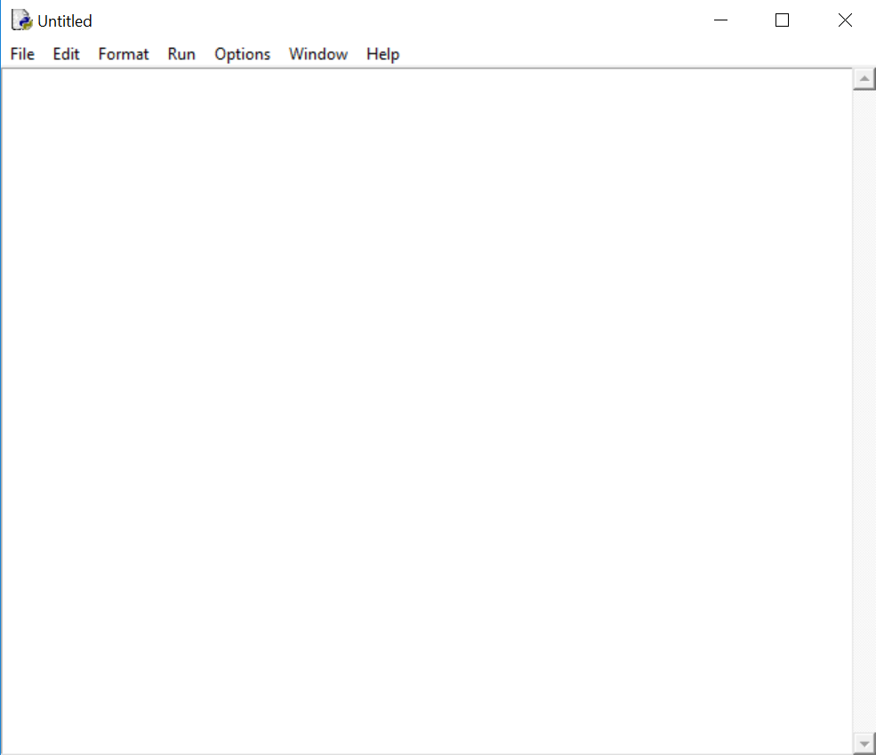

# Presentación del sistema de desarrollo

Presentación del sistema de desarrollo:

Basta con entrar en IDLE, del que hemos hablado antes:

Ésta es la pantalla del intérprete, donde se ejecutarán los programas que hagamos. El salto a las pantallas a las que todos estamos acostumbrados con botones... queda fuera del alcance de este curso, no por dificultad sino por tiempo. 

Al ir a **File -&gt; New File** se abre el editor de texto, que tiene esta pinta:

La ventaja que tiene es que, a partir de esta pantalla, podemos probar nuestro programa fácilmente con **Run Module** y, al tener un contador de filas, nos dirá dónde hemos cometido los errores, si los hay.

