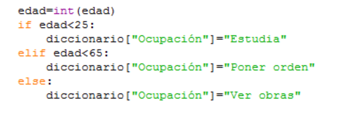

# Programa 12

**Descripción del problema:**

Si miramos el programa número 11, nos damos cuenta de que es todo como un spaghetti, empieza en la primera orden y es todo secuencial hasta el final. Además, a la hora de la lectura, eso de ver el trozo donde se mira la ocupación con tres declaraciones de dicha parte del diccionario no la facilita, como se ve a continuación.

Este tipo de programación se le llama Programación Spaghetti. El programa que hemos hecho es sumamente simple pero, si imaginamos un programa de 2000 líneas, el problema de lectura puede ser tan serio que retocar algo del mismo nos suponga un dolor.

Para evitar esto existen las funciones, que no es otra cosa que sacar código del hilo principal para llamarlo cuando nos convenga. De esta forma, tendremos el **programa** muy claro para leer y retocar.

El programa 12 consiste en extraer la parte de la ocupación del hilo principal.

**Materia nueva:**

Una función se define en Python de la siguiente manera:

**def** nombredelafuncion (**variablesquevaausar**)

    Órdenes
    return(variableadevolver)

Para recibir el dato que devuelve (**return** significa devolver) es necesario guardarlo en algún sitio. Lo habitual es asignarlo a una variable:

variable=nombredelafuncion (variablequeleentregamos)

 Respecto a la ubicación de las funciones, lo habitual es declararlas antes de que empiece el programa. Por lo tanto, las primeras líneas se dedican a escribir funciones y el hilo principal del programa viene después.

Una vez definida, la llamada es tan simple como poner el nombre de la función y decirle qué variables va a usar.

¡Cuidado! Las variables que va a usar no son aquellas con las que se le llama. Digamos que la función recibe unas variables pero, para no modificar las del programa, hace una copia cambiándoles el nombre y usa las que ha copiado.

NOTA: Si te has dado cuenta, a lo largo de todo el curso he hablado de "órdenes", pues bien, era mentira: son "funciones". Se ha hecho así porque era demasiado duro empezar a hablar de algo que quedaba muy lejos en el progreso de aprendizaje; mejor ver primero para qué sirven y luego ya se explicará el por qué.

