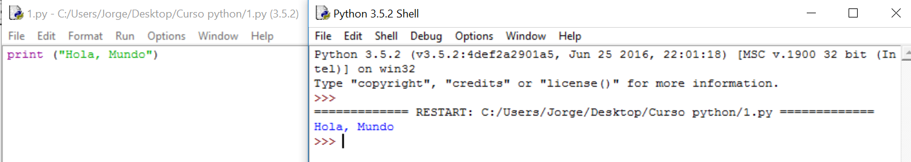

# Solución

**Algoritmo:**

Mostrar "Hola, Mundo" en pantalla

**Solución:**

Si todo ha ido bien, ¡Enhorabuena! Ya has dado el mismo primer paso que los más grandes programadores. Si no, bastaría con reinstalar Python, posiblemente habrá habido algún problema al elegir si 32 o 64 bits.

Observa que el propio editor nos ayuda diferenciando mediante colores la función de cada palabra.

**Explicación:**

**print("Hola, Mundo"):** Es la orden que hemos nombrado como materia nueva. En este caso tenemos que mostrar un texto, es la primera opción que hemos nombrado de esta orden.

**Hola, Mundo** es el texto que debe sacar. Por eso está entre comillas, porque tiene que mostrarlo tal cual.

**Comentarios:**

A veces, como ayuda, en el propio editor sale un texto mientras estamos escribiendo una orden. Es una ayuda que nos indica su sintaxis.

