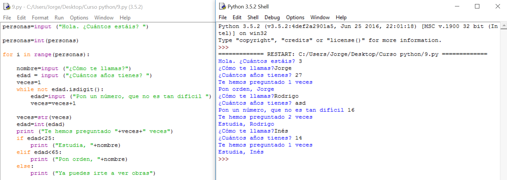

# Solución

**Algoritmo:**

1.- Saludo y pregunto cuánta gente hay

2.- Para cada uno de ellos:

2.1.- Pido el nombre

2.2.- Pido la edad

2.3.- Compruebo que se puede convertir en número y, si no puede, repito la pregunta hasta que pueda. Voy guardando en una variable las veces que hago esto.

2.4.- Le digo las veces que se lo he preguntado.

2.5.- Comparo la edad y, si es menor de 25 le digo que estudie

Si es menor de 65 le digo que ponga orden

Si es mayor o igual a 65 le digo que se vaya

**Solución:**

  

**Explicación:**

Es necesario darse cuenta de que se ha identado el programa anterior para que forme parte de la estructura for, pues tenía que repetir todo el programa anterior. Menos mal que tenemos la identación para aclarar un poco las diferentes partes que componen el programa.

Si quieres identar una gran cantidad de texto, el editor tiene una opción para identar un montón de líneas a la vez y que no sea necesario hacerlo a mano. Está en **format: indent region**.

