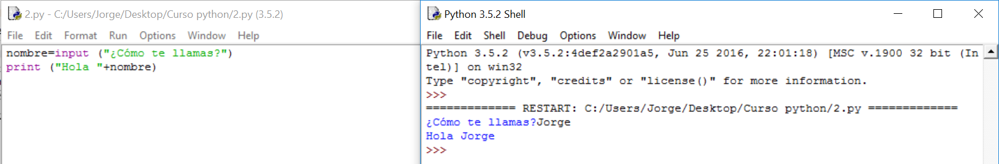

# Solución

**Algoritmo:**

1.- Pedimos el nombre. No sabíamos hacerlo hasta ahora, anteriormente sólo hemos mostrado texto sin esperar respuesta, como la necesitamos, usaremos **input** .

2.- Anotamos ese nombre. Si estuviéramos hablando con alguien, lo guardaríamos en un trozo de nuestra memoria y asociaríamos su cara a su nombre. El ordenador hace lo mismo pero no puede asociar caras, así que , en vez de asociar su cara, le pone un nombre. No sabíamos hacerlo hasta ahora pero ya conocemos los tipos de variable y cómo se asignan sus valores. 

3.- Saludamos con lo que hemos anotado. Eso ya intuimos que será con la orden **print **porque eso ya sabemos hacerlo.

 

**Solución:**

**Análisis del programa:**

**nombre=input("¿Cómo te llamas?") **Esta línea es la que hemos empleado para guardar el nombre. En este caso, **nombre** es una variable a la que se le asigna (por medio de **=**) lo que escriba el usuario. **Input** viene del inglés y se traduce como: conjunto de datos que se introducen en un programa o sistema informático. En este caso, **input **pone al ordenador a la espera de recibir texto del teclado. En resumen, la línea entera guarda lo que el usuario escriba en una variable, que ocupará una parte de memoria del ordenador, y a la que nos podremos referir siempre con ese nombre.

**print ("Hola, "+nombre) **Como vimos en el programa anterior, la función **print** puede sacar por pantalla tanto texto como variables o una mezcla de los dos. Éste es el último caso. Observad que hay un espacio detrás de la "**,**"** **ya que, si no, lo pondría todo junto. El ordenador no sabe lo que queda bien o mal en un texto. 

**Comentarios:**

- No le hemos dicho de qué tipo de variable estamos hablando. Él, por su cuenta, habrá decidido una. Sabemos que será una Cadena de caracteres por venir de una respuesta a un **input**. La ventaja en Python es que él decide qué tipo de variable utiliza sin que la declaremos y nos ahorra alguna línea que otra. La desventaja es que, para saber de qué tipo es, habrá que preguntarle.

- Debemos elegir los nombres de las variables de forma que nos den una idea de los datos que contienen. Favorecerá la lectura de nuestros programas.

# Solución

**Algoritmo:**

1.- Preguntaremos cuánta gente hay

2.- A cada uno le preguntaremos su nombre y su edad. Guardaremos las dos variables anteriores y la tarea que tienen que hacer (poner orden, estudiar y mirar obras) en un diccionario. 

3.- Pediremos que nos diga el número de persona que quiere que le mostremos.

4.- Lo mostraremos en pantalla.

**Solución:**

**Comentarios:**

** **Aquí hay que comentar un error bastante curioso que tiene más que ver con cómo hace las cosas Python que con la programación en sí. Prueba a cambiar la declaración diccionario={} a justo antes del **for** y usa la siguiente orden al final del programa:

**print (str( **presentes**))** Para que saque por pantalla toda la lista que hemos introducido.  

Verás que ha guardado el último tantas veces como gente había. Esto es porque, cada vez que se declara, hace uno nuevo, si no, sólo se está alterando el mismo todo el rato. 

No hace falta que lo entiendas, realmente es un error de Python, aunque conozco que se da en varios lenguajes más. Simplemente, quédate con que las variables, para que se puedan usar varias veces, es necesario que tengan su espacio en memoria diferente, y eso lo haces declarándolas de nuevo ya que Python les busca un nuevo hueco en memoria aunque las llame igual. 

Es necesario también destacar el recurso de restar 1 a la variable que nos dice qué persona queremos para ajustar el que el ordenador empiece a contar por el 0 y nosotros por el 1.

 

 

