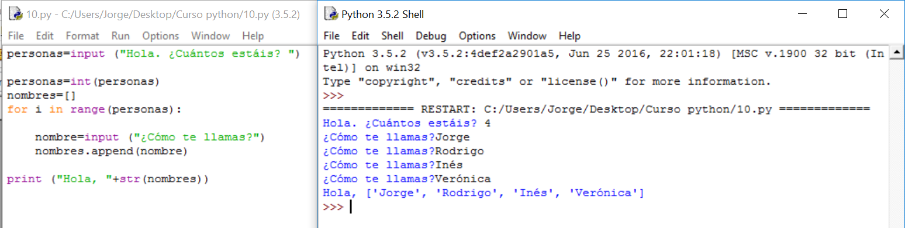

# Solución

**Algoritmo:**

1.- Saludo y pregunto cuánta gente hay

2.- Para cada uno de ellos:

     2.1.- Pido el nombre y lo voy almacenando en algún sitio: Una lista.

3.- Saludo a todos poniendo la lista después de "Hola, ".

**Solución:**

**Comentarios:**

Como se ve, la transformación a texto de la lista es bastante mala para presentarla en pantalla. A lo largo de los dos ejercicios siguientes vamos a ver cómo solucionarlo. 

