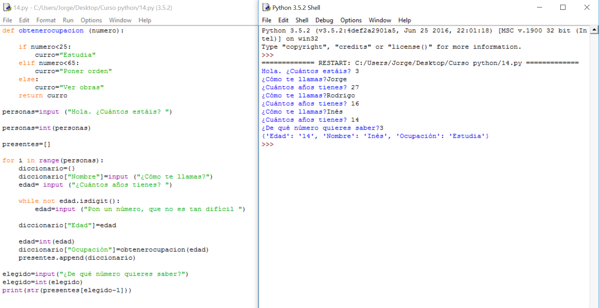

# Solución

**Algoritmo:**

1.- Preguntaremos cuánta gente hay

2.- Para cada uno de ellos se les pregunta y:

     2.1.- En un diccionario iremos guardando nombre y edad.

     2.2.- A la hora de elegir ocupación haremos una llamada a una función que lo calculará *Problema

3.- Pediremos que nos diga el número de persona que quiere que le mostremos.

4.- Lo mostraremos en pantalla.

**Solución:**

