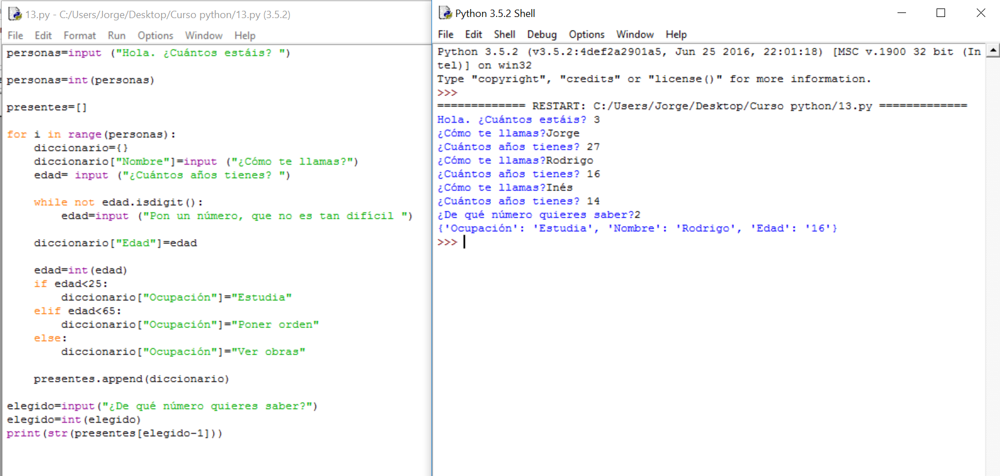

# Solución

**Algoritmo:**

1.- Preguntaremos cuánta gente hay

2.- A cada uno le preguntaremos su nombre y su edad. Guardaremos las dos variables anteriores y la tarea que tienen que hacer (poner orden, estudiar y mirar obras) en un diccionario. 

3.- Pediremos que nos diga el número de persona que quiere que le mostremos.

4.- Lo mostraremos en pantalla.

**Solución:**

**Comentarios:**

Aquí hay que comentar un error bastante curioso que tiene más que ver con cómo hace las cosas Python que con la programación en sí. Prueba a cambiar la declaración diccionario={} a justo antes del **for** y usa la siguiente orden al final del programa:

**print (str( **presentes**))** Para que saque por pantalla toda la lista que hemos introducido.  

Verás que ha guardado el último tantas veces como gente había. Esto es porque, cada vez que se declara, hace uno nuevo, si no, sólo se está alterando el mismo todo el rato. 

No hace falta que lo entiendas, realmente es un error de Python, aunque conozco que se da en varios lenguajes más. Simplemente, quédate con que las variables, para que se puedan usar varias veces, es necesario que tengan su espacio en memoria diferente, y eso lo haces declarándolas de nuevo ya que Python les busca un nuevo hueco en memoria aunque las llame igual. 

Es necesario también destacar el recurso de restar 1 a la variable que nos dice qué persona queremos para ajustar el que el ordenador empiece a contar por el 0 y nosotros por el 1.
