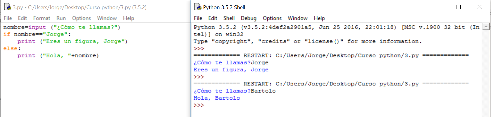

# Solución

**Algoritmo:**

1.- Pide el nombre y lo anota. Lo sabemos hacer

2.- Compara ese nombre con el nuestro (que se lo habremos dicho en algún lado del programa, veremos varias posibilidades). No lo sabíamos hacer hasta ahora, usaremos la estructura **if**.

3.- Si coincide, nos saludará de una forma especial, si no, como a todo el mundo. Sabemos hacer la parte del saludo pero, como hay dos formas, intuimos que deberemos ponerle las dos y que elija según el resultado del **if**.

 

**Solución:**

Como puede verse en la salida, se ha ejecutado dos veces, una respondiendo con el nombre especial y otra con otro nombre. Cada vez ha entrado en una parte de la estructura if distinta.

**Explicación:**

La estructura **if** es muy simple en este caso, sólo tenemos que distinguir dos posibilidades, por eso únicamente hay **if **y **else.**

**if nombre=="****Jorge":** le dice: Si lo que la variable nombre contiene es igual (**==**) a la palabra (por eso está entrecomillado) "**Jorge"** entonces sigue lo que te digo tras los dos puntos "**:"**

**else: **le dice: Si no se ha cumplido la comparación del **if** entonces haz lo siguiente a los dos puntos "**:"**. 

**Comentarios:**

Prueba a poner "Jorge", o tu nombre, sin comillas. 

