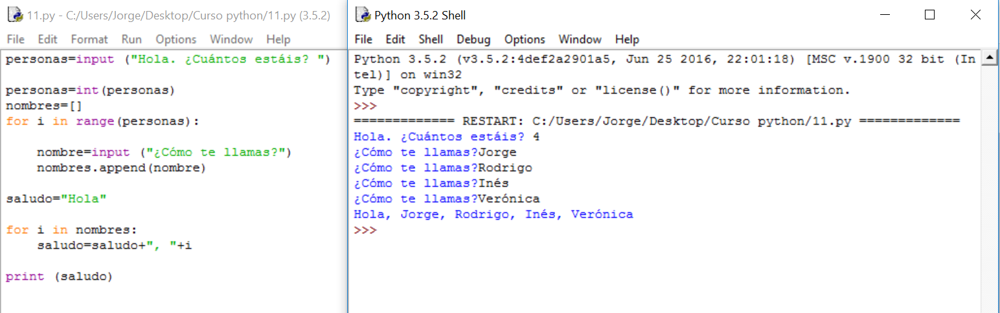

# Solución

**Algoritmo:**

1.- Saludo y pregunto cuánta gente hay

2.- Para cada uno de ellos:

     2.1.- Pido el nombre y lo voy almacenando en algún sitio: Una lista.

3.- Modifico la variable donde haya puesto "Hola, " para ir añadiéndole nombres según recorro la lista. 

**Solución:**

**Comentarios:**

Es necesario hacer la tabla indicada en el apartado de **Materia nueva **para entender qué está pasando con la variable **saludo**. Queda como ejercicio.

Queda como ejercicio conseguir que entre **Inés **y **Verónica** haya una **y.**

