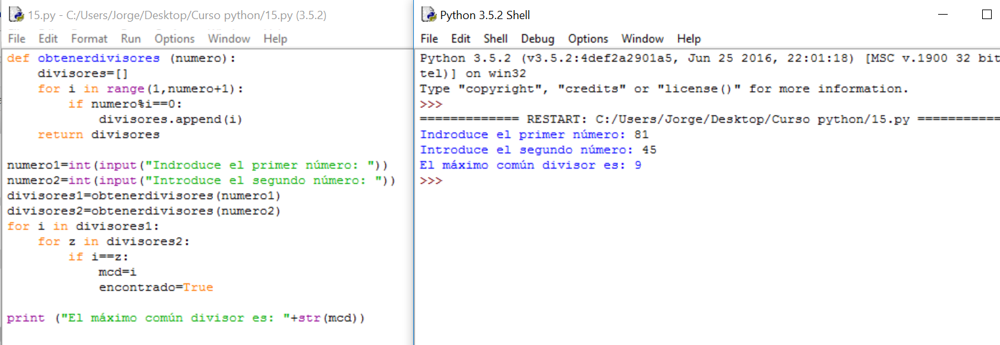

# Solución

**Algoritmo:**

1.- Pedimos los dos números

2.- Calculamos sus divisores

3.- El mcd se obtiene comparando las dos listas. El mayor divisor que esté en las dos listas será el máximo común divisor. La forma más rápida es:

      3.1.- Comparar el más pequeño del primer número con todos los del otro número. Lo guardo si coincide.

      3.2.- Comparo el siguiente del primer número con todos los del otro número. Lo guardo si coincide.

      3.3.- Cuando haya terminado, el último número que tenga guardado será el mcd.

**Solución:**

**Comentarios:**

El mayor problema de este programa es realizar un algoritmo que calcule el mínimo común divisor. Si las dificultades vienen de ahí, no pasa nada, se irá alcanzando la suficiencia algorítmica con el tiempo y la práctica.

