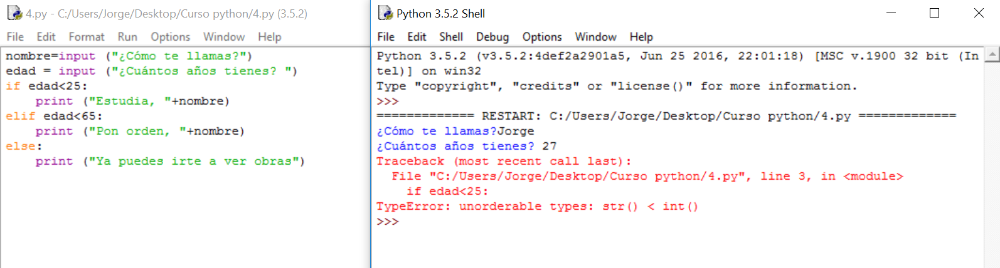
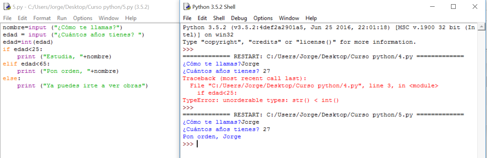

# Solución

**Algoritmo:**

1.- Pido el nombre.

2.- Pido la edad.

3.- Comparo la edad y, si es menor de 25 le digo que estudie.

     3.1.- Si es menor de 65 le digo que ponga orden.

     3.2.- Si es mayor o igual a 65 le digo que se vaya.

**Solución:**

¿Qué ha pasado? Sencillamente que quería que vierais un error muy frecuente en programación.

Dijimos que Python era fuertemente tipado y hemos comparado una cadena de caracteres con un número. 

Es muy importante conocer la diferencia entre 2 y “2”. El primero es un número y el segundo es un texto. Algo así como 2 y "dos" para nosotros. Si queremos sumar, no podemos usar la palabra “dos”, debemos usar el número.

Rehagamos el programa pero pasando ese “2” a 2. Para ello, existe una función que vamos a usar: 

**int**(textoquequeramoscambiaranúmero) Si queremos enteros

**float**(textoquequeramoscambiaranúmero) Si queremos decimales

Cambiemos el programa:

**Explicación:**

**edad=int(edad)** es algo muy común en programación si no queremos guardar variables de sobra. En estos casos, se realiza primero la parte derecha y luego guarda el resultado en la variable de la izquierda. En este caso, transforma la variable **edad** en entero y la guarda en el mismo trozo de memoria donde estaba la variable **edad **original. Huelga decir que ese primer valor que tenía lo ha perdido.

**Comentarios:**

Como ejercicio, prueba también:

<li>
edad=int (input(“¿Cuántos años tienes?”))
</li>
<li>
edad=float(edad) A ver si hay diferencia si es un entero o no.
</li>
<li>
Introduce 24 como edad para comprobar que sólo entra como alumno.
</li>
<li>
Introduce “a” como edad, a ver qué pasa.
</li>
<li>
Realiza el algoritmo para ajustarlo a esa modificación que hemos realizado después del fallo.

