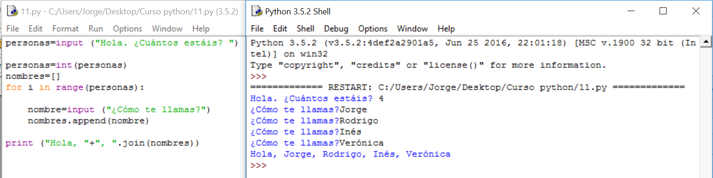

# Solución

**Algoritmo:**

1.- Saludo y pregunto cuánta gente hay

2.- Para cada uno de ellos:

     2.1.- Pido el nombre y lo voy almacenando en algún sitio: Una lista.

3.- Convierto la lista en una Cadena de caracteres que poder sumarle al saludo "Hola, ". 

**Solución:**

 

