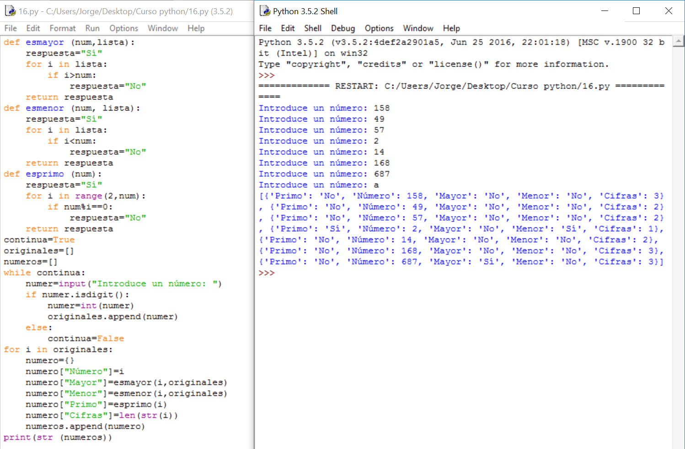

# Solución

**Algoritmo:**

1.- Pedir números hasta que haya una introducción que no se pueda convertir en uno. Ir guardándolos en una lista

2.- Para cada uno de ellos:

- 2.1.- Guardarlo bajo la "Key": "Número"

- 2.2.- Comprobar si es menor, mayor y primo y guardarlo bajo las "Keys": "Menor", "Mayor" y "Primo"

- 2.3.- Contar con la función **len( **s **) **la cantidad de caracteres del número pasado a Cadena de caracteres y guardarlo bajo la "Key": "Cifras"

3.- Sacar la lista de diccionarios por la pantalla. 

**Solución:**

**Explicación:**

En este caso, en las órdenes:

numero["Mayor"]=esmayor(i,originales)   y esmenor(i,originales)  podemos ver que se ha trasladado a la función una lista entera. 

Podría parecer que sólo admitiría variables simples pero, realmente, no existe límite de datos o variables a la hora de pasar a las funciones.

Sin embargo, cada función usa una lista diferente. Sí, en Python no se permite usar el original de ninguna variable enviada a una función. Si nos pusiéramos puristas, esto duplicaría la cantidad de memoria reservada en el ordenador a nuestro programa; es verdad, pero la cantidad de memoria y la capacidad de cálculo han dejado de ser un problema hace mucho tiempo.

Respecto a la función **len(**s**)**, ha habido que pasarlo primero a Cadena de caracteres para poder realizarlo.  

