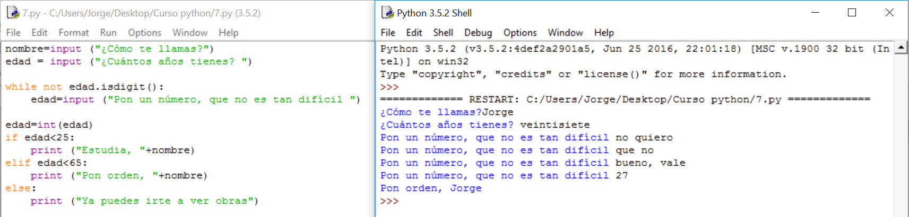

# Solución

**Algoritmo:**

1.- Pido el nombre

2.- Pido la edad

3.- Compruebo que se puede convertir en número y, si no puede, repito la pregunta hasta que pueda. Hasta ahora no lo sabíamos hacer pero en esta frase tenemos la condición que se debe cumplir para que **while** haga o no la pregunta.

4.- Comparo la edad y, si es menor de 25 le digo que estudie, si es menor de 65 le digo que ponga orden y si es mayor o igual a 65 le digo que se vaya

**Solución:**




<br /><br />

**Explicación:**

En este caso, como la orden que he puesto dentro de la estructura **while** se ejecutará sólo si es cierta y lo que quiero es que lo haga si no es cierta. La he negado con un "**not**". También se podría haber hecho de otra forma (usando otra variable y una estructura **if**) pero es un engorro. Toma nota de esta negación porque se usa mucho.

El hecho de poner la pregunta dentro de la estructura **while** permite que cada vez haya un valor distinto para comparar. Si no das la oportunidad de que el usuario corrija su error con una nueva respuesta, la comparación contenida en **while** siempre valdrá lo mismo y tendrás un fantástico bucle infinito. Realmente ningún programador puede considerarse tal sin haber realizado varios en su vida. Al final se les pilla cariño, es más emocionante si lo haces en un servidor y puedes tirar tu web y la de todos los que estén alojados allí, pero en un ordenador también es entrañable. Es broma, es deseable que no te pase pero es inevitable.

La idea del bucle infinito sería:
```python
while not edad.isdigit():
print ("No has puesto un número")
```
En este caso, si **edad** no es un dígito, entra en el bucle **while** pero **print** no pregunta y **edad** seguirá sin serlo para cuando vuelva a **while** y, así, indefinidamente. El flujo es: **while** - Comparación - Verdadero - **print** - **while** - Comparación - Verdadero - ...

De la forma que lo hemos puesto:   **while** - Comparación - Verdadero - **input** - Nuevo valor de **edad** - **while** - Comparación - Verdadero o falso ya que **edad** ahora es distinto, le hemos dado al usuario una oportunidad de verdad - ...

**Comentarios:**

Realiza un bucle infinito: Cambia el **input** de la solución por un **print**, al que habrá que quitarle la variable que precedía al **input**.

La forma de salir de algo así es, si no te avisa y no te permite cancelarlo cerrando el intérprete, como siempre en el mundo de la informática: **Ctrl+Alt+Supr**

