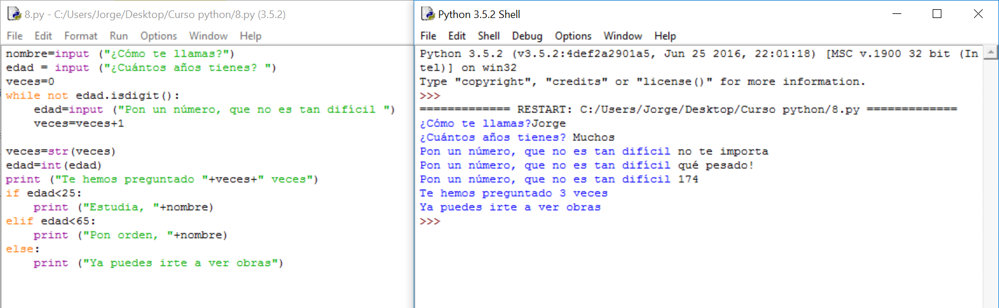

# Solución

**Algoritmo:**

1.- Pido el nombre

2.- Pido la edad

3.- Compruebo que se puede convertir en número y, si no puede, repito la pregunta hasta que pueda. Voy guardando en una variable las veces que hago esto.

4.- Le digo las veces que se lo he preguntado. Como debo convertir el número en texto para sacarlo por pantalla, usaré **str(**variable**)**.

5.- Comparo la edad y, si es menor de 25 le digo que estudie.

     5.1.- Si es menor de 65 le digo que ponga orden.

     5.2.- Si es mayor o igual a 65 le digo que se vaya.

 

**Solución:**

**Explicación:**

Recuerda que **veces=veces+1** consiste en que el ordenador hace la parte derecha antes y la guarda como la variable de la izquierda. No hagas el cálculo matemático y despejes: 0=1. Sabes que se tiene que leer:

La nueva **veces** es igual a la antigua **veces** más uno

**Comentarios:**

Quedan como ejercicios:

<li>
Buscar otra forma de sumarle 1 a una variable en Python más abreviada. En otros lenguajes hay cosas como veces++, busca en internet si hay algo así. Para esto hay una página en concreto que es una referencia en preguntas y respuestas: [http://es.stackoverflow.com](http://es.stackoverflow.com)
</li>
<li>
Probar a mostrar el número de veces sin haber transformado la variable en texto.
</li>
<li>
Probar qué pasa si ponemos el número sin fallar ninguna vez y solucionar el dato erróneo que da.
</li>
<li>
 Probar a hacerlo de tal forma que, cada vez que pregunte, diga las veces que lleva. Hay muchas formas de hacerlo pero te puede servir de ayuda el hecho de que **str(**veces**)** no convierte la variable **veces** en texto si no se guarda, simplemente devuelve una Cadena de caracteres a partir del valor de **veces**. 
</li>

Probar a mostrar el número de veces sin haber transformado la variable en texto.

