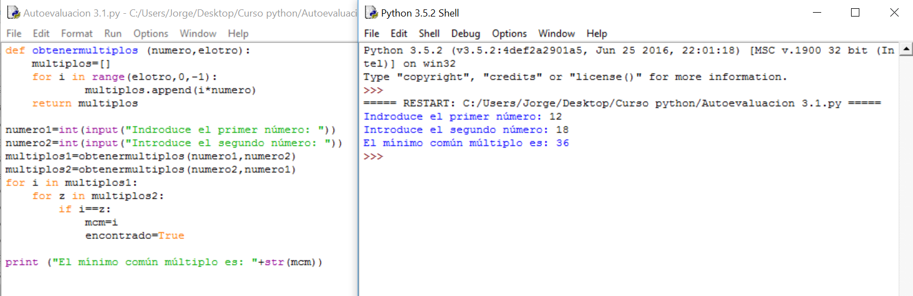
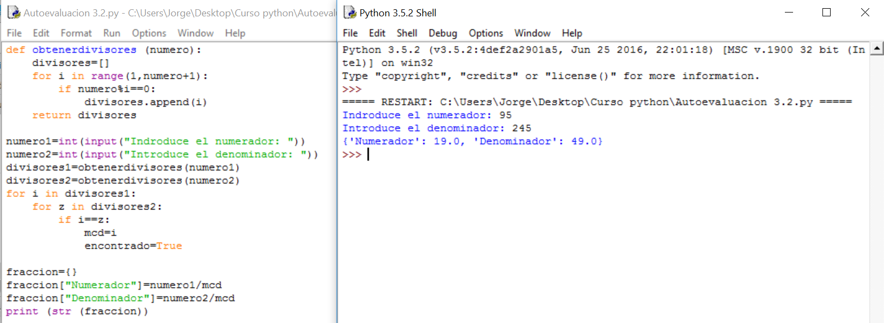
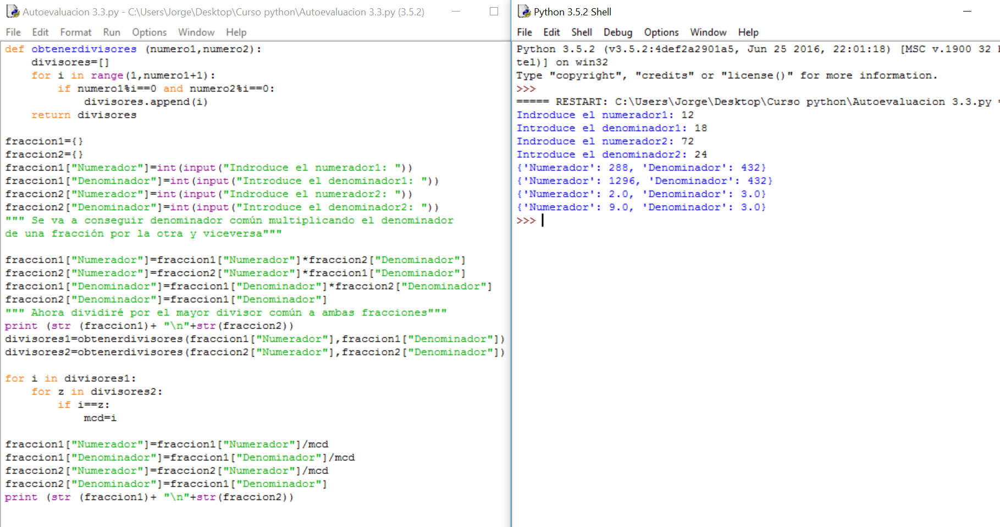
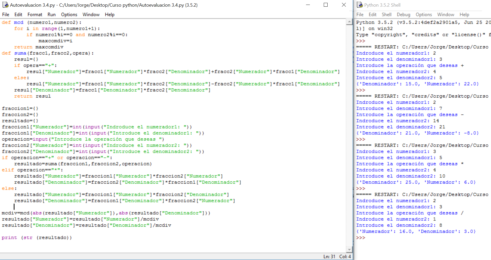

# Soluciones a los ejercicios de autoevaluación

En este caso, hay un paso intermedio que se muestra. Conforme los programas se complican, es necesario decirle que saque por pantalla ciertos valores en determinados momentos para controlar que se está haciendo lo que queremos. Imagina si hubiera 2000 líneas. 

Los valores correctos son los últimos.

En este caso se han optimizado ciertos algoritmos: Se ha utilizado la función **suma** para sumar y restar y se ha cambiado la función para obtener el máximo común divisor. Esto es lo que suele pasar cuando se le dan varias vueltas al mismo programa. La solución óptima no es exigible a nuestro nivel pero irás viendo que cada vez eres capaz de obtener soluciones más eficientes. 

Gracias por haber seguido el curso, te deseo muchos éxitos.

